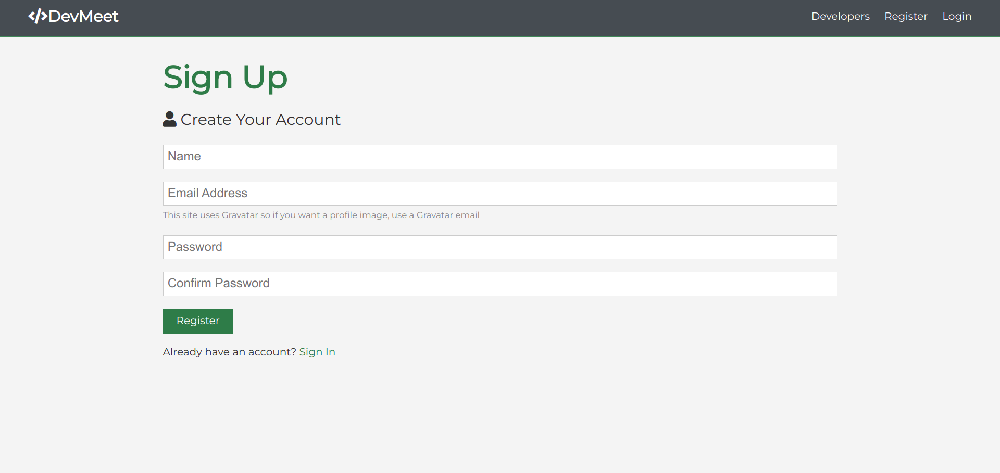

# Devmeet

https://devmeet-n.herokuapp.com/

> This is a social media platform where developers can connect and share their thoughts, a MERN stack application that includes authentication, profiles and forum posts.

---

# Setup

### Add a default.json file in config folder with the following

```json
{
  "mongoURI": "<your_mongoDB_Atlas_uri_with_credentials>",
  "jwtSecret": "secret"
}
```

### Install server dependencies

```bash
npm install
```

### Install client dependencies

```bash
cd client
npm install
```

### Run both Express & React from root

```bash
npm run dev
```

### Build for production

```bash
cd client
npm run build
```

---

## Screenshort of the Project


<br>

<br>

<br>

<br>

<br>

<br>
